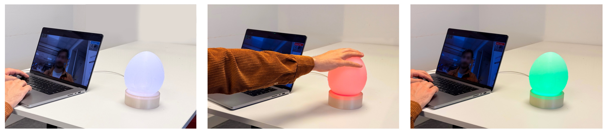

# Lumen: Blink Detection with Desk Companion


A webcam-driven computer vision pipeline (MediaPipe Face Mesh, blink detection, rolling baseline, risk scoring) controls a physical LED object over serial to an ESP32-S3, built to show a full CV-to-hardware loop working end to end.

## What this is, and isn't

This is a computer vision and embedded systems demonstration: real-time facial landmark tracking, a blink detection and signal processing pipeline built from scratch, and a physical actuator driven by that signal. The eye strain framing is the applied context that motivated the build, not a product claim.

All processing happens locally in memory. Video frames are never saved to disk, and the only outbound data is a single-letter state command (C/A/B) sent over a local USB serial connection to the dome. No cloud calls, no logging, nothing persists after the process exits.

It is not a medical or clinical tool. It does not diagnose, treat, or claim to reduce Computer Vision Syndrome or any condition. Blink rate is used here as a heuristic signal, chosen because it is measurable in real time from a laptop webcam, not as a validated biomarker. No population study or efficacy evaluation was performed; the only validation here is blink-detection accuracy (F1), reported below. The pipeline tracks eye landmarks and eyelid closure, not gaze direction.

## Approach

Webcam >> MediaPipe Face Mesh >> Eye Aspect Ratio (EAR) blink detection >> rolling baseline >> risk score >> serial >> ESP32-S3 >> NeoPixel ring.

- **EAR-based blink detection, not a learned classifier**: `EAR = (A + B) / (2 · C)` from six MediaPipe landmarks per eye, thresholded in real time at 0.21 (open eyes read ~0.25-0.30, closed ~0.05-0.08). No training data or model required.
- **Rolling baseline with a literature floor**: `BaselineEngine` keeps a 30-sample rolling mean, pre-filled with a literature-derived prior (15 blinks/min, Rosenfield 2011) so it's meaningful from sample one, floored at 7 blinks/min so a sustained low rate can't drag its own reference down and quietly read as normal.
- **Weighted risk score**: `RiskEngine` computes `risk_score = 0.5 × blink_risk + 0.5 × focus_risk`, where `blink_risk = max(0, (reference − current_rate) / reference)` and `focus_risk` saturates at 1.0 after 20 minutes without a break. CALM below 0.3, ATTENTION below 0.6, BREAK at or above.
- **State machine driving physical hardware**: `main.py` sends single-letter state commands (C/A/B) over serial on every state change. The firmware runs its own local logic for the tap/hold button gestures and queues incoming commands during an override, so software and hardware each own a distinct part of the behavior rather than one blindly relaying to the other.



## Results

Blink detection accuracy, validated against manual count across lighting and distance:

| Condition | Distance | F1 |
|---|---|---|
| Direct sunlight | 1.0 m | 1.00 |
| Direct sunlight | 1.5 m | 0.97 |
| Direct sunlight | 2.0 m | 0.85 |
| Sunlight + head turns (±45°) | 1.0 m | 0.92 |
| Table lamp only | 1.5 m | 0.91 |
| Table lamp only | 2.0 m | 0.57 |

Headline: **F1 = 0.92** (head-turn condition, the most conservative passing result, not the best case). Operating envelope is 60-150 cm; every condition tested in that range clears F1 = 0.90. Setup: MacBook Pro built-in camera, 1920x1080, 60 fps.

The full loop, webcam to risk score to ESP32-S3 to LED, plus tap-to-pause and hold-to-breathe, was flashed and tested end to end on the physical hardware.

## Limitations and failure analysis

- EAR threshold (0.21) tuned for one indoor setup, not re-validated under office or conference lighting.
- Accuracy drops sharply beyond ~1.5 m in low light (F1 = 0.57 at 2 m under lamp-only light).
- Head turns beyond ~30° compress eye landmarks and can register as false blinks.
- Fails under tinted or semi-transparent glasses; built for clear lenses or bare eyes.
- Baseline has no persistence across sessions and takes ~30 samples to settle, so the first minute of any run reads against a literature-prior floor, not the user's actual resting rate.
- The ring's breadboard solder joints can flicker under mechanical stress until reflowed (see `hardware/BUILD.md`); electronics aren't yet rigidly mounted inside the enclosure.

## How to run

Requires Python 3.12, MediaPipe 0.10.14 breaks on 3.13's `mp.solutions` API.

```bash
git clone https://github.com/fammad/lumen.git
cd lumen
pip install -r requirements.txt
python main.py
```

Runs with just the webcam window if no dome is connected. Full build guide, parts list, wiring, firmware flashing, board settings, and connecting the dome to `main.py`, is in **[hardware/BUILD.md](hardware/BUILD.md)**.

The loop underneath `main.py`, stripped to its core:

```python
baseline_state = baseline.get_state()
risk = risk_engine.get_risk(baseline_state, now)
# risk["recommended_state"] -> "CALM" / "ATTENTION" / "BREAK"
```

Supporting modules live in `core/`. Everything for the physical build, firmware and parts list and wiring, lives in `hardware/`.

Keyboard: `q` quit, `r` reset, `d` toggle demo/real baseline speed, `1`/`2`/`3` force CALM/ATTENTION/BREAK, `0` clear override.

## Status

Submitted to NordiCHI 2026 Demo track, not accepted for logistical reasons, not a reflection of the work's quality.

## Credits

Licensed under MIT. If you build on this or reuse parts of it, a credit or link back is appreciated but not required.

**Fuad Mammadov**
[fammad.com](https://fammad.com/work/lumen) · [LinkedIn](https://www.linkedin.com/in/fammad/) · fred.mmov@gmail.com

Yuting Chen (KTH) collaborated on the physical hardware sessions and breathing-pattern testing for the NordiCHI 2026 submission, "Lumen: A Tangible Somaesthetic Peripheral for Negotiated Screen-Work Interruption." Extended abstract archived at [archive/lumen-nordichi2026-extended-abstract.pdf](archive/lumen-nordichi2026-extended-abstract.pdf).
