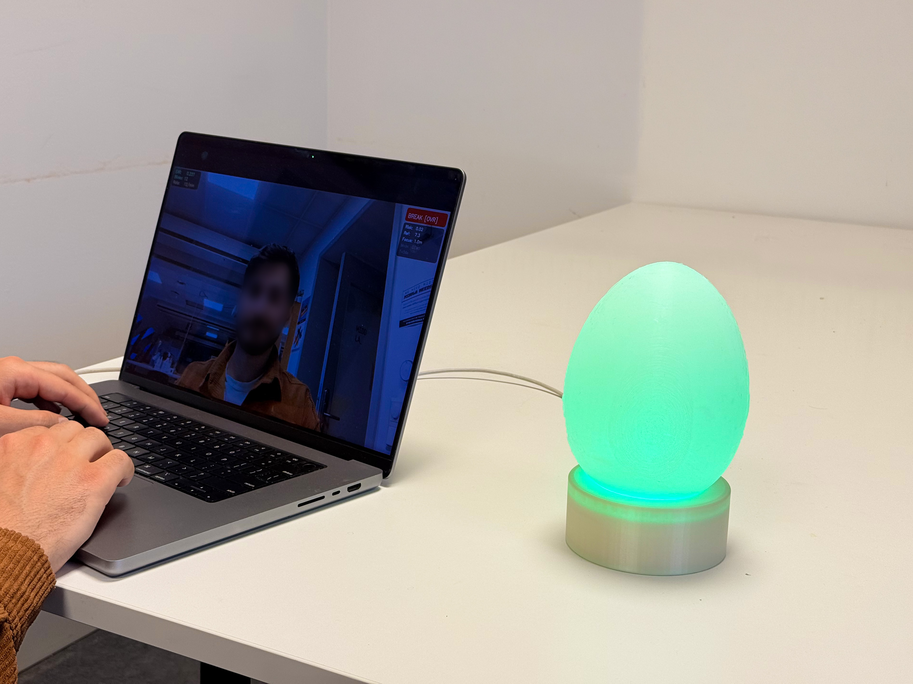

# Lumen



A physical desk object that senses blink rate via webcam and signals eye strain risk through ambient light, so a break can be negotiated rather than demanded by a notification.

## Problem

Digital wellbeing tools mostly interrupt immediately — a popup, a chime, a lock screen. Lumen signals state peripherally through light instead, letting the user decide when or whether to act. The underlying signal is blink rate, which drops from a healthy 15-20/min to 4-7/min during sustained screen focus (Rosenfield, 2011).

## Approach

Webcam → MediaPipe Face Mesh → EAR blink detection → rolling baseline → risk score → serial → ESP32-S3 → NeoPixel ring.

- **EAR over a learned classifier**: six landmarks per eye, thresholded, real time on a laptop webcam, no training data needed.
- **Baseline has a floor**: reference rate is the mean of the last 30 samples, clamped to a literature floor (7/min), so sustained strain can't drag the baseline down and quietly read as normal.
- **Time alone can't trigger BREAK**: `risk = 0.5 * blink_risk + 0.5 * focus_risk`. Focus duration caps at 0.5 — physiological evidence has to be present too.
- **Auto vs. negotiated control**: `main.py` sends single-letter state commands (C/A/B) over serial on every auto-state change. The button overrides locally — tap pauses, hold starts a 4-7-8 breathing exercise — and incoming auto-commands queue until the override ends.

## Results

Blink detection validated against manual count:

| Condition | Distance | F1 |
|---|---|---|
| Direct sunlight | 1.0 m | 1.00 |
| Direct sunlight | 1.5 m | 0.97 |
| Direct sunlight | 2.0 m | 0.85 |
| Sunlight + head turns (±45°) | 1.0 m | 0.92 |
| Table lamp only | 1.5 m | 0.91 |
| Table lamp only | 2.0 m | 0.57 |

Headline: **F1 = 0.92** (head-turn condition — the most conservative passing result, not the best case). Operating envelope 60-150 cm; every condition tested in that range clears F1 = 0.90. Setup: MacBook Pro built-in camera, 1920x1080, 60 fps.

The full loop — webcam to risk score to ESP32-S3 to LED, plus tap-to-pause and hold-to-breathe — was flashed and tested end to end on the physical hardware.

## Limitations and failure analysis

- EAR threshold (0.21) tuned for one indoor setup; not re-validated under office or conference lighting.
- Accuracy drops sharply beyond ~1.5 m in low light (F1 = 0.57 at 2 m under lamp-only light).
- Head turns beyond ~30° compress eye landmarks and can register as false blinks.
- Fails under tinted or semi-transparent glasses; built for clear lenses or bare eyes.
- Baseline has no persistence across sessions and takes ~30 samples to settle, so the first minute of any run reads against a literature-prior floor, not the user's actual resting rate.
- The ring's breadboard solder joints can flicker under mechanical stress until reflowed (see `hardware/BUILD.md`); electronics aren't yet rigidly mounted inside the enclosure.

## How to run

Requires Python 3.12 — MediaPipe 0.10.14 breaks on 3.13's `mp.solutions` API.

```bash
pip install -r requirements.txt
python main.py
```

Supporting modules live in `core/`. Everything for the physical build — firmware, parts list, wiring — lives in `hardware/`.

Runs with just the webcam window if no dome is connected. Full build guide — parts list, wiring, firmware flashing, board settings, and connecting the dome to `main.py` — is in **[hardware/BUILD.md](hardware/BUILD.md)**.

Keyboard: `q` quit, `r` reset, `d` toggle demo/real baseline speed, `1`/`2`/`3` force CALM/ATTENTION/BREAK, `0` clear override.

## Status

Submitted to NordiCHI 2026 Demo track; not accepted — logistical, not a reflection of the work's quality.

## Credits

Yuting Chen (KTH) collaborated on the physical hardware sessions and breathing-pattern testing. Blink-rate grounding: Rosenfield, M. (2011), *Computer vision syndrome: a review of ocular causes and potential treatments*, Ophthalmic and Physiological Optics.
